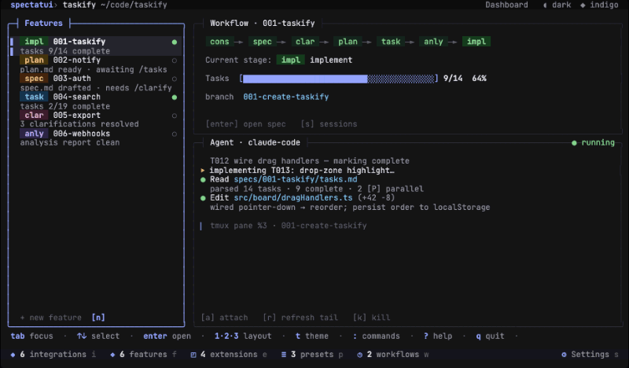

<div align="center">

<picture>
  <source media="(prefers-color-scheme: dark)" srcset="assets/images/spectatui-tagline-dark.svg">
  
</picture>

[](https://github.com/tinesoft/spectatui/actions/workflows/ci.yml)
[](LICENSE)
[](https://crates.io/crates/spectatui)

</div>

A terminal UI dashboard for [GitHub Spec-Kit](https://github.com/github/spec-kit) — track features, manage specifications, integrations, presets, workflows, extensions and monitor AI agent workflows, all from your terminal.

---

<div align="center">


<br><em>💡Tip: I recommend installing and using [Jetbrains Mono](https://github.com/jetbrains/jetbrainsmono) font for a nice looking terminal as seen above</em>

</div>

---

## ✨ Features

- 🧩 **Extensions manager** — Browse, add, enable/disable, update, and prioritize Spec-Kit extensions
- 🎚️ **Presets manager** — Browse, add, enable/disable, update, and prioritize Spec-Kit presets
- 🤖 **AI Integrations manager** — Install, switch, upgrade, and inspect Spec-Kit integrations (Claude Code, etc.)
- 🔄 **Workflows manager** — Run, resume, and inspect active Spec-Kit workflows
- 👁️ **Live auto-refresh** — Watches `specs/` and `.specify/` and updates the dashboard automatically when files change on disk
- 📖 **Spec / Plan / Tasks / Research browser** — Navigate `spec.md`, `plan.md`, `tasks.md`, `research.md` with rendered Markdown and task checkboxes
- 📜 **Constitution viewer** — Read your project's `.specify/memory/constitution.md` from any screen
- 🪜 **Workflow stepper** — Visual stage tracker across `cons → spec → clar → plan → task → anly → impl` with task progress bar
- 🔗 **Session attach** — Suspend the TUI and hand off to a live tmux session; send follow-up messages inline
- 🖥️ **Agent output pane** — Live tail of the tmux agent session with attach/refresh/kill controls
- 📤 **CLI job output popup** — Dedicated scrollable view for spawned CLI job output
- 🎯 **Command palette** — Quick-navigate and execute commands (`:` or `Ctrl-K`)
- 🗂️ **Multi-pane dashboard** — Overview, Coding, Audit, and Custom layouts (switch with `1`–`4`)
- 🎨 **Custom layout editor** — Reorder, resize, and toggle visibility of panes; save as your own layout
- ⚙️ **Settings editor** — In-app settings: theme, accent, dashboard layout, mouse support, tmux prefix, and more, persited globally or per-project
- 🌓 **Dark & light themes** — Toggle with `t`
- 🌈 **Accent palette** — Cycle through Indigo, Teal, and Amber with `T`
- 🐭 **Mouse support** — Optional click support for list rows, tabs, status-bar counters, and settings chips
- 🌐 **Cross-platform** — Runs on Linux, macOS, and Windows (x86_64 & ARM)

---

## 📦 Installation

<details>
<summary><strong>Linux / macOS</strong></summary>

```sh
curl -fsSL https://raw.githubusercontent.com/tinesoft/spectatui/main/install.sh | sh
```

Pass `--version` to pin a specific release, or `--to <dir>` to choose an install location:

```sh
curl -fsSL https://raw.githubusercontent.com/tinesoft/spectatui/main/install.sh | sh -s -- --version 1.0.0
```

</details>

<details>
<summary><strong>Windows</strong></summary>

**Option 1 — MSI installer (recommended):**

Download `spectatui-*-x86_64-pc-windows-msvc.msi` from the [Releases page](https://github.com/tinesoft/spectatui/releases) and run it. The installer adds `spectatui` to your system `PATH` automatically and appears in Add/Remove Programs for easy uninstall.

Silent install (no UI):

```powershell
msiexec /i spectatui-*-x86_64-pc-windows-msvc.msi /quiet /norestart
```

**Option 2 — ZIP (manual):**

Download `spectatui-*-x86_64-pc-windows-msvc.zip`, then in PowerShell:

```powershell
Expand-Archive spectatui-*-x86_64-pc-windows-msvc.zip -DestinationPath spectatui
Move-Item spectatui\spectatui.exe "$env:USERPROFILE\.cargo\bin\"
```

</details>

<details>
<summary><strong>GitHub Releases (all platforms)</strong></summary>

Download the pre-built binary for your platform from the [Releases page](https://github.com/tinesoft/spectatui/releases), extract the archive, and place the binary on your `PATH`.

| Platform            | Archive                                        |
| ------------------- | ---------------------------------------------- |
| Linux x86_64        | `spectatui-*-x86_64-unknown-linux-gnu.tar.gz`  |
| Linux aarch64       | `spectatui-*-aarch64-unknown-linux-gnu.tar.gz` |
| macOS Intel         | `spectatui-*-x86_64-apple-darwin.tar.gz`       |
| macOS Apple Silicon | `spectatui-*-aarch64-apple-darwin.tar.gz`      |
| Windows x86_64      | `spectatui-*-x86_64-pc-windows-msvc.zip`       |

</details>

<details>
<summary><strong>Verifying release provenance</strong></summary>

Every release binary carries a [GitHub Artifact Attestation](https://docs.github.com/en/actions/security-guides/using-artifact-attestations-to-establish-provenance-for-builds) proving it was built by this repo's `release.yml` workflow from the corresponding tagged commit. Verify a downloaded archive with the [GitHub CLI](https://cli.github.com/):

```sh
gh attestation verify spectatui-v1.0.0-x86_64-unknown-linux-gnu.tar.gz --owner tinesoft
```

</details>

<details>
<summary><strong>Cargo (all platforms)</strong></summary>

```sh
cargo install spectatui
```

</details>

<details>
<summary><strong>Build from source</strong></summary>

```sh
git clone https://github.com/tinesoft/spectatui.git
cd spectatui
cargo build --release -p spectatui
# Binary is at: dist/target/spectatui/release/spectatui
```

</details>

---

## 🚀 Usage

```sh
spectatui [OPTIONS]

Options:
  -p, --project <PATH>   Path to the Spec-Kit project root [default: .]
      --theme <THEME>    Override theme: dark or light
      --accent <ACCENT>  Override accent: indigo, teal, or amber
  -h, --help             Print help
```

### Key bindings

**Global** (active on every screen):

| Key             | Action                               |
| --------------- | ------------------------------------ |
| `t`             | Toggle dark / light theme            |
| `T`             | Cycle accent (Indigo → Teal → Amber) |
| `:` or `Ctrl-K` | Open command palette                 |
| `?`             | Open help                            |
| `i`             | Open Integrations popup              |
| `f`             | Open Features popup                  |
| `w`             | Open Workflows popup                 |
| `q`             | Quit (with confirm)                  |
| `Ctrl-C`        | Force quit                           |

**Dashboard**:

| Key                   | Action                                             |
| --------------------- | -------------------------------------------------- |
| `1` / `2` / `3` / `4` | Switch layout (Overview / Coding / Audit / Custom) |
| `Tab` / `Shift-Tab`   | Cycle pane focus                                   |
| `↑` / `k` · `↓` / `j` | Navigate feature list                              |
| `Enter`               | Open Spec browser for selected feature             |
| `e`                   | Open Extensions & Presets popup                    |
| `p`                   | Open Presets popup                                 |
| `s`                   | Open Settings                                      |
| `c`                   | Open Constitution viewer                           |
| `a`                   | Go to Session attach                               |

**Spec browser**:

| Key                   | Action                                               |
| --------------------- | ---------------------------------------------------- |
| `Tab` / `Shift-Tab`   | Switch document tab (Spec / Plan / Tasks / Research) |
| `↑` / `k` · `↓` / `j` | Scroll                                               |
| `←` / `→`             | Previous / next feature                              |
| `Esc`                 | Back to Dashboard                                    |

**Popups** (Integrations, Extensions, Presets, Workflows):

| Key                   | Action           |
| --------------------- | ---------------- |
| `↑` / `k` · `↓` / `j` | Navigate list    |
| `/`                   | Filter           |
| `a`                   | Add              |
| `x`                   | Remove           |
| `e` / `d`             | Enable / Disable |
| `u`                   | Update           |
| `Esc`                 | Close            |

**Settings**:

| Key                   | Action                         |
| --------------------- | ------------------------------ |
| `↑` / `k` · `↓` / `j` | Navigate rows                  |
| `←` / `→` or `Enter`  | Adjust value / enter edit mode |
| `Esc`                 | Back to Dashboard              |

---

## ⭐️ Star History

<a href="https://www.star-history.com/?repos=tinesoft%2Fspectatui&type=date&legend=top-left">
 <picture>
   <source media="(prefers-color-scheme: dark)" srcset="https://api.star-history.com/chart?repos=tinesoft/spectatui&type=date&theme=dark&legend=top-left&sealed_token=THzzX8bIFtyKCJOc35qOaciDDjzwpYwbhwnOWQNb4k9YXBkBHV3R7UEzLUBxyRefPMroPZ-M3Qqyam2Njm0Fy37P8KY0Ofpl9itcX8HeEK_dPAW9Vn8YRMx65R-cMraAaAx8Xj7SuIKEPNLmUS5IJbZ1F6AP9-FAB4yMCNoU_VBUie-WHw87Xhhwz8D-" />
   <source media="(prefers-color-scheme: light)" srcset="https://api.star-history.com/chart?repos=tinesoft/spectatui&type=date&legend=top-left&sealed_token=THzzX8bIFtyKCJOc35qOaciDDjzwpYwbhwnOWQNb4k9YXBkBHV3R7UEzLUBxyRefPMroPZ-M3Qqyam2Njm0Fy37P8KY0Ofpl9itcX8HeEK_dPAW9Vn8YRMx65R-cMraAaAx8Xj7SuIKEPNLmUS5IJbZ1F6AP9-FAB4yMCNoU_VBUie-WHw87Xhhwz8D-" />
   
 </picture>
</a>

---

## 🤝 Contributing

Contributions are welcome! See [CONTRIBUTING.md](CONTRIBUTING.md) for development setup, git workflow, and commit conventions.

---

## 📄 License

[MIT](LICENSE) © 2026 Tine Kondo
