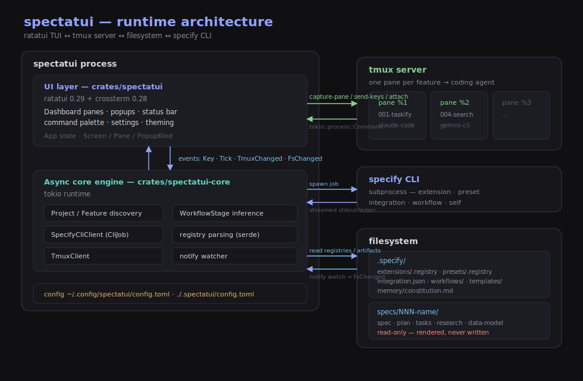

# spectatui — Architecture & Design Doc

*Your TUI dashboard for GitHub Spec-Kit*

**spectatui** (`spectatui`) is a tmux-backed, ratatui-rendered control plane and
visualizer for [GitHub Spec Kit](https://github.com/github/spec-kit) —
giving Spec-Driven Development a dashboard: live lifecycle status, extensions
and presets, integrations and automation workflows, the constitution and
spec/plan/tasks artifacts, and one pane per active feature's coding-agent
session.

## 1. What Spec Kit actually looks like (grounding facts)

The design matches the real `specify` CLI and on-disk layout:

- **Project layout** after `specify init` + a few lifecycle steps:
  ```
  .
  ├── .specify/
  │   ├── memory/constitution.md
  │   ├── scripts/bash/*.sh          (or powershell equivalents)
  │   ├── templates/*.md             (spec/plan/tasks/constitution/checklist templates)
  │   ├── templates/overrides/       (project-local template overrides, only if used)
  │   ├── integration.json           (default + installed integrations, per-agent settings)
  │   ├── integrations/              (per-integration installed-file manifests)
  │   ├── extension-catalogs.yml     (extension catalog sources, only if customized)
  │   ├── extensions/
  │   │   ├── .registry              (JSON despite no extension — installed extensions, source of truth for reads)
  │   │   └── <extension-id>/
  │   ├── preset-catalogs.yml        (preset catalog sources, only if customized)
  │   ├── presets/
  │   │   ├── .registry              (same shape as extensions/.registry)
  │   │   └── <preset-id>/
  │   └── workflows/                 (installed automation workflows — see §1.6)
  │       └── <workflow-id>/workflow.yml
  └── specs/
      └── 001-feature-name/
          ├── spec.md
          ├── plan.md
          ├── tasks.md
          ├── research.md
          ├── data-model.md
          ├── quickstart.md
          └── contracts/
  ```
- **Lifecycle commands** (run inside the AI agent as slash commands / skills):
  `/speckit.constitution`, `/speckit.specify`, `/speckit.clarify`,
  `/speckit.plan`, `/speckit.tasks`, `/speckit.analyze`, `/speckit.checklist`,
  `/speckit.implement`, `/speckit.taskstoissues`, `/speckit.converge`.
- **Extensions** add new capabilities. CLI surface:
  `specify extension search [query] [--tag] [--author] [--verified]`,
  `add <name> [--dev] [--from <url>] [--priority <N>]`,
  `remove <name> [--keep-config] [--force]`, `list [--available] [--all]`,
  `info <name>`, `update [<name>]`, `enable <name>` / `disable <name>`,
  `set-priority <name> <priority>`, and `catalog list|add|remove`.
- **Presets** customize the format/terminology of existing commands. Same shape
  of CLI surface as extensions *minus* `update` (presets have no update):
  `specify preset search|add|remove|list|info|set-priority|enable|disable|resolve|catalog *`.
  `preset resolve <name>` traces the full resolution stack for a template and
  shows which source wins.
- Resolution order, highest priority first: project-local overrides
  (`.specify/templates/overrides/`) → installed presets (by priority) →
  installed extensions (by priority) → Spec Kit core (`.specify/templates/`).
- A feature gets its own git branch and `specs/NNN-name/` directory the moment
  `/speckit.specify` runs.
- **Integrations** are coding-agent installs with a *different* command shape
  from extensions/presets — not generic add/remove/enable/disable, but
  install-state and "which one is active" semantics:
  `specify integration install|uninstall|switch|upgrade <key>`,
  `list [--catalog]`, `status [--json]`, `use <key>`, `search`, `info <key>`,
  and `catalog *`. 30+ integrations are supported (Claude Code, Copilot,
  Cursor, Codex, Gemini CLI, Windsurf, Zed, …), each flagged whether it needs a
  CLI tool vs. is IDE-only. One project has one `default_integration` plus zero
  or more additional installed ones. `integration status --json` is genuinely
  machine-readable (file-integrity / drift detail included).
- **Automation workflows** (`specify workflow`) are a *separate* concept from
  the lifecycle — see §1.6.

spectatui's job is to make all of this — lifecycle stage, constitution,
extensions, presets, integrations, automation workflows, and the live agent —
visible and navigable in one terminal screen, without re-implementing Spec Kit
itself.

## 1.5. Core principle: the Nx Console model

The governing design rule: **spectatui is to `specify` what Nx Console is to
`nx`.** Two strictly different zones:

- **`specs/` (spec.md, plan.md, tasks.md, research.md, …) — read-only,
  always.** spectatui renders these for visualization only. It never writes to
  them, never offers a "remove" or "edit" action on them, and never calls
  `specify` on their behalf. They're the AI agent's and the user's domain;
  spectatui is a window onto them, not an editor.
- **`.specify/extensions/`, `.specify/presets/`, integrations, workflows, and
  their catalogs — fully interactive, but CLI-mediated only.** Search, view
  details, install, remove, enable/disable, reprioritize, switch, run — every
  one of these is a thin wrapper that shells out to the real `specify` subcommand
  and shows the result. spectatui never edits `.registry`, `integration.json`,
  extension directories, or catalog YAML files directly, and never
  re-implements install/removal/priority logic itself. The CLI is the only thing
  that mutates state; spectatui is the dashboard and the confirmation layer in
  front of it, exactly like Nx Console never computes a dependency graph itself —
  it calls `nx graph` and renders the result.

This keeps spectatui safe to update independently of Spec Kit's internal file
formats (which can change between releases) and means every destructive action
goes through the same validation, confirmation prompts, and backup behavior the
CLI already implements (e.g. `extension remove` backs up config by default
unless `--keep-config`/`--force` is passed).

## 1.6. Two different "workflow" concepts in Spec Kit

Spec Kit has **two unrelated things both called "workflow"**, and spectatui
surfaces both, kept distinct on purpose:

1. **The lifecycle** — the fixed
   constitution → specify → clarify → plan → tasks → analyze → checklist →
   implement sequence a feature moves through. In code this is `WorkflowStage`
   (§4), rendered as the per-feature stepper (badges `cons spec clar plan task
   anly impl`).
2. **`specify workflow`** — an actual automation/pipeline engine. Every new
   project ships one pre-installed workflow, `speckit` ("Full SDD Cycle"), an
   installable, runnable YAML pipeline that *automates* the lifecycle commands
   end-to-end with review gates: `specify workflow run <id>`, with progress
   trackable via `specify workflow status [run_id]` and resumable via
   `specify workflow resume`. Unlike extensions/presets, workflows have **no**
   enable/disable/set-priority/update subcommands — they're run-once pipelines,
   not always-on customizations, so they get their own action shape (§5).

The status bar's **workflows** count means installed automation workflows from
`specify workflow list` — separate from the **features** count, which is the
`specs/NNN-name/` directories.

## 2. Feature set (v1)

1. **Feature/session manager** — list every `specs/NNN-name/` feature, its
   current lifecycle stage, and its tmux session status.
2. **Spec/plan/tasks browser** — rendered markdown viewer for
   `spec.md` / `plan.md` / `tasks.md` / `research.md` / `data-model.md`, with
   `tasks.md` parsed into a checklist (respecting `[P]` parallel markers and
   per-user-story phases).
3. **Constitution viewer** — `.specify/memory/constitution.md`, always one
   keypress away regardless of which feature is selected.
4. **Extensions manager** — search catalogs, view installed/available
   extensions with full detail, install, remove, enable/disable, reprioritize —
   all by shelling out to `specify extension *` (§1.5, §5). Catalog *sources*
   are managed in the unified catalog manager (item 12).
5. **Presets manager** — search catalogs, view installed/available presets with
   full detail, install, remove, enable/disable, reprioritize — all by shelling
   out to `specify preset *` (§1.5, §5). Catalog *sources* are managed in the
   unified catalog manager (item 12).
6. **Integrations manager** — list installed/available coding-agent
   integrations, install/uninstall/switch/use-default, upgrade, and check drift
   via `integration status --json`, all via `specify integration *` (§5) — a
   deliberately different action model from extensions/presets.
7. **Automation workflows manager** — list, run, resume, and check status of
   `specify workflow` pipelines (§1.6, §5) — distinct from the lifecycle
   timeline below.
8. **Lifecycle timeline** — constitution → specify → clarify → plan → tasks →
   analyze → checklist → implement, per feature, inferred from which files exist.
9. **Live agent view** — tail of the tmux pane running the agent for the
   selected feature, with a one-key jump to a fully attached session.
10. **Customizable layout** — show/hide panes, rearrange them, switch between
    layout presets; persisted between runs.
11. **Theming** — dark / light themes and an accent palette, persisted.
12. **Unified catalog manager** — a single popup to manage catalog *sources* for
    all four resource kinds — extensions, presets, integrations, and workflows —
    tabbed by kind, with add / remove / reprioritize / toggle install-vs-discovery
    on each source, every edit shelling out to `specify <kind> catalog *`
    (§5, §6.5). Reachable from the **catalogs** status-bar stat, `c` from
    anywhere, or the "Manage Catalogs" command-palette entry. Catalog sources are
    no longer buried inside the individual extensions/presets manager.

## 3. High-level architecture

A ratatui app (UI layer) sits on top of an async core engine; the engine talks
to a tmux server (one pane per feature session), to the filesystem (`.specify/`
+ `specs/`), and to the `specify` CLI as a subprocess. The two layers map
directly onto the crate split (§9): `crates/spectatui` is the UI/event loop,
`crates/spectatui-core` is the engine.



- **UI layer — `crates/spectatui`** (ratatui + crossterm): draws the dashboard
  panes, popups, status bar, command palette, and settings; holds `App` state
  and consumes an event stream (`Key`, `Tick`, `TmuxChanged`, `FsChanged`).
- **Async core engine — `crates/spectatui-core`** (tokio): `Project`/`Feature`
  discovery and `WorkflowStage` inference, the `SpecifyCliClient` that spawns
  `specify` subprocesses and streams their output, registry parsing, the
  `TmuxClient`, and a `notify` filesystem watcher.
- **tmux server**: one pane per feature runs a coding agent. `TmuxClient` drives
  it via `tokio::process::Command` (`capture-pane` for the tail, `send-keys`,
  full `attach` for the handoff screen).
- **Filesystem**: the engine reads `.specify/` (registries, `integration.json`,
  constitution, templates, workflows) and `specs/` artifacts, and watches both
  for external changes. `specs/` is strictly read-only.
- **`specify` CLI**: every mutation is a spawned subprocess whose stdout/stderr
  is streamed into the CLI output log.

spectatui is **one instance per project** — it always operates on the single
repo it's run from (or pointed at via `--project`), so `Project` is a singleton
in `App` state and there's no project-switcher UI.

## 4. Data model

Engine types live in `crates/spectatui-core/src/speckit/` (`mod.rs`,
`registry.rs`, `workflow.rs`).

```rust
struct Project {
    root: PathBuf,
    constitution: Option<PathBuf>,       // .specify/memory/constitution.md
    features: Vec<Feature>,
    extensions: Vec<ExtensionInfo>,
    presets: Vec<PresetInfo>,
    integrations: Vec<IntegrationInfo>,
    workflows: Vec<WorkflowInfo>,        // automation workflows, §1.6 — not WorkflowStage
}

struct Feature {
    id: String,                          // e.g. "001-create-taskify"
    branch: Option<String>,              // git branch, if discoverable
    dir: PathBuf,                        // specs/001-create-taskify/
    artifacts: FeatureArtifacts,
    stage: WorkflowStage,                // derived, not stored
}

struct FeatureArtifacts {
    spec: Option<PathBuf>,
    plan: Option<PathBuf>,
    tasks: Option<PathBuf>,
    research: Option<PathBuf>,
    data_model: Option<PathBuf>,
    quickstart: Option<PathBuf>,
    contracts_dir: Option<PathBuf>,
}

enum WorkflowStage {                     // the lifecycle, §1.6 (label "new" for NotStarted)
    NotStarted,
    Specified,     // spec.md exists
    Clarified,     // spec.md has a Clarifications section
    Planned,       // plan.md exists
    TasksGenerated,// tasks.md exists
    Analyzed,      // analyze report / marker present
    Implementing,  // tasks.md has some [x] but not all
    Implemented,   // tasks.md fully checked off
}

enum InstallStatus { Enabled, Disabled, Available }

enum ExtensionSource { Catalog(String), Dev(PathBuf), Url(String), Local }

struct ExtensionInfo {
    id: String,
    version: String,
    status: InstallStatus,               // Enabled / Disabled (installed), Available (catalog-only)
    priority: Option<u8>,                // None if not installed
    command_count: u32,
    source: ExtensionSource,
    author: Option<String>,
    description: String,
}

struct PresetInfo {
    id: String,
    version: String,
    status: InstallStatus,
    priority: Option<u8>,
    template_count: u32,
    author: Option<String>,
    source_label: Option<String>,
    description: String,
}

struct IntegrationInfo {
    key: String,                         // e.g. "claude", "copilot", "cursor"
    name: String,                        // e.g. "Claude Code"
    installed: bool,
    is_default: bool,                    // matches integration.json's default_integration
    cli_required: bool,                  // CLI tool vs. IDE-based
    version: Option<String>,
    description: String,
}

struct WorkflowInfo {
    id: String,                          // e.g. "speckit"
    name: Option<String>,                // e.g. "Full SDD Cycle"
    version: Option<String>,
    source: Option<String>,              // e.g. "bundled", "catalog · community"
    installed: bool,
    description: String,
    last_run: Option<String>,            // run-history summary, if any
}

struct TmuxSession {
    name: String,
    pane_id: String,
    status: SessionStatus,               // Running, Idle, Exited(code)
    last_snapshot: Vec<String>,          // captured pane lines for the tail view
}
```

`WorkflowStage` is derived by checking, in order: does `spec.md` exist? does it
contain a `## Clarification…` section? does `plan.md` exist? does `tasks.md`
exist, and what fraction of its `- [x]` / `- [ ]` checkboxes are done? This is
read-only inference — it never writes anything back to `specs/`. Re-validate the
exact heading/checkbox conventions against the *current* spec-kit templates
(`.specify/templates/*.md`) in the target project, since they can change between
releases.

`ExtensionInfo`/`PresetInfo` are populated from **two sources**: parse the local
`.specify/extensions/.registry` / `.specify/presets/.registry` (JSON, no file
extension) for a fast, no-subprocess listing of what's *installed*; call
`specify extension list --available` / `specify preset search` for what's
*available but not installed* (these become `InstallStatus::Available` entries).
`IntegrationInfo` reads `.specify/integration.json` for instant local state and
can call `specify integration status --json` for the richer drift view.
`WorkflowInfo` is populated from `specify workflow list`. The registry files are
read-only input to spectatui's display — never written by spectatui.

The persistent status bar (§6.5) shows six counts, derived directly from this
model: integrations (`installed == true`), features (`features.len()`),
extensions and presets (`status != Available`), workflows
(`installed == true`), and catalogs (total catalog sources across all four
resource kinds).

## 5. CLI action model

This is the Nx-Console-shaped part of spectatui. Extensions and presets share
one `CliTarget`-parameterized action set (near-identical CLI surfaces and
identical registry shapes); integrations and automation workflows have genuinely
different command verbs, so they get dedicated action variants rather than a
third `CliTarget`. All of them live in one `CliAction` enum
(`crates/spectatui-core/src/speckit/cli.rs`).

Catalog-source management is the one concern that cuts across all four resource
kinds: extensions, presets, integrations, and workflows each resolve their
installable items from one or more catalog sources. So the `Catalog*` actions are
parameterized by their own `CatalogTarget` (all four kinds), and spectatui
surfaces them through a single unified catalog popup (§6.5) — tabbed by kind —
rather than burying catalog management inside each individual manager.

```rust
enum CliTarget { Extension, Preset }
enum CatalogTarget { Extension, Preset, Integration, Workflow }  // catalog sources exist for all four

enum CliAction {
    // Extension / preset (CliTarget-parameterized)
    Search { target: CliTarget, query: Option<String>, tag: Option<String>, author: Option<String> },
    Info { target: CliTarget, id: String },
    List { target: CliTarget, available: bool },
    Add { target: CliTarget, id: String, priority: Option<u8>, dev_path: Option<PathBuf>, from_url: Option<String> },
    Remove { target: CliTarget, id: String, keep_config: bool, force: bool },
    Enable { target: CliTarget, id: String },
    Disable { target: CliTarget, id: String },
    SetPriority { target: CliTarget, id: String, priority: u8 },
    Update { target: CliTarget, id: Option<String> },   // extension-only in practice — presets have no update
    Resolve { name: String },                           // preset-only

    // Catalog sources — one action set spanning all four resource kinds (§6.5 unified popup)
    CatalogList { target: CatalogTarget },
    CatalogAdd { target: CatalogTarget, url: String, name: String, priority: Option<u8> },
    CatalogRemove { target: CatalogTarget, name: String },

    // Integrations (install-state / active-default semantics)
    IntegrationList,
    IntegrationInstall { key: String },
    IntegrationUninstall { key: String },
    IntegrationUpgrade { key: Option<String> },
    IntegrationUseDefault { key: String },              // change default without uninstalling others
    IntegrationSwitch { key: String },                  // switch active, replacing the previous one's files
    IntegrationStatus { key: String },                  // status --json — the rich drift-check view
    IntegrationGetInfo { key: String },

    // Automation workflows (§1.6 — no enable/disable/set-priority)
    WorkflowAdd { source: String },
    WorkflowRemove { id: String },
    WorkflowRun { source: String },
    WorkflowResume { run_id: String },
    WorkflowStatus { run_id: Option<String> },
    WorkflowGetInfo { id: String },
    WorkflowSearch { query: Option<String> },

    SelfCheck,
    SelfUpgrade,
}

struct CliJob {
    action: CliAction,
    command_line: String,        // exact `specify ...` invocation, shown before running
    status: JobStatus,           // Pending, Running, Succeeded, Failed
    output: String,              // streamed stdout+stderr
}
```

`CliAction::to_command_line()` maps an action to the exact `specify …` string;
`CliAction::is_destructive()` flags the mutating actions that require
confirmation. `SpecifyCliClient` runs the command via `tokio::process::Command`
with piped stdout/stderr and streams output lines as `CliEvent`s into
`CliJob.output` — surfaced live in a dedicated **CLI output log** popup/pane,
the same way Nx Console shows a live terminal panel while a generator runs.

**Confirmation flow**, modeled on Nx Console's "preview the command, then run
it" pattern:

1. The user picks an action in a manager panel/popup (e.g. "remove" on an
   installed extension).
2. spectatui builds the `CliAction` and renders the exact resulting command line
   (`specify extension remove my-ext --force`) for review — nothing has run yet.
3. Non-destructive actions (`search`, `info`, `list`, `resolve`, `catalog list`,
   `status`) run immediately.
4. Destructive/mutating actions require an explicit confirm keypress. By default
   `--force` is *not* passed, so the CLI's own confirmation prompt is the second
   line of defense; `--force` is only added when the user opts into skipping
   prompts. This default is configurable (`confirm_before_force`, §6).
5. On completion, spectatui refreshes the relevant list from the registry/CLI so
   the UI reflects the new state — it never optimistically mutates local state.

Most `extension`/`preset`/`workflow` outputs are Rich-formatted tables/text with
no JSON flag; `specify version --features --json` and `specify integration
status --json` are the only genuinely machine-readable surfaces. Parse
table-formatted stdout for `search`/`list`/`info`, expecting that to need
maintenance as CLI output formatting changes across releases, and treat the
local `.registry` files as the more stable source for currently-installed state.

## 6. Customizable panes

### Model

The pane model lives in `crates/spectatui-core/src/layout.rs`. Integrations and
workflows are surfaced as *popups* (§6.5), not as docked pane kinds.

```rust
enum PaneKind {
    FeatureList,
    SpecBrowser,
    Constitution,
    ExtensionsPresets,
    WorkflowTimeline,    // the lifecycle stepper for the selected feature
    AgentOutput,
    CliOutputLog,        // live stdout/stderr of the current CliJob
}

struct PaneConfig {
    kind: PaneKind,
    visible: bool,
    order: u8,           // position within the layout
    size: u8,            // relative size (1–4) within its split
}

struct CustomLayout {
    panes: Vec<PaneConfig>,
}
```

The dashboard offers four layouts (`DashboardLayout`): `Overview` (feature list
+ lifecycle timeline + agent output), `Coding` (spec browser + agent output
side-by-side), `Audit` (extensions/presets + constitution), and `Custom` (the
user-defined `CustomLayout`).

### Rearranging panes in a terminal

Terminals don't support GUI drag-and-drop, so "rearrange" means:

- **Keyboard reordering**: a layout-editor mode (`< >`) swaps the focused pane's
  position in `CustomLayout.panes`, immediately re-rendering the splits.
- **Show/hide toggles**: `space` flips `visible`, recomputing the grid so hidden
  panes don't reserve space.
- **Resize**: `+`/`-` adjusts a pane's `size`.
- **Layout presets**: the three built-in arrangements above are each one
  keypress (`1`/`2`/`3`), on top of full manual customization in the editor.

### Persistence

`AppConfig` (`crates/spectatui/src/config.rs`) is stored via the `directories`
crate at `~/.config/spectatui/config.toml` (XDG on Linux/macOS, `%APPDATA%` on
Windows), with an optional project override at `.spectatui/config.toml` inside
the target repo (a spectatui-only file, not part of Spec Kit's override stack).
It persists:

```rust
struct AppConfig {
    theme: String,                 // "dark" | "light"
    accent: String,               // "indigo" | "teal" | "amber"
    dashboard_layout: String,      // "overview" | "coding" | "audit"
    mouse_support: bool,
    agent_tail_follow: bool,
    confirm_before_force: bool,    // §5 step 4
    custom_layout: Option<CustomLayout>,
}
```

## 6.5. Screens

A complete interactive mockup of every screen below lives at
[`design/Spectatui.dc.html`](Spectatui.dc.html) (open it in a browser); this
section captures the decisions baked into it.

`Screen` is one of `Dashboard`, `SpecBrowser`, `Constitution`,
`ExtensionsPresets`, `Settings`, or `SessionAttach`.

### Dashboard (default screen)

The `Overview` layout shows three regions plus the persistent chrome:

- **Feature list** (left sidebar) — one row per `specs/NNN-name/` feature: stage
  badge (abbreviated `WorkflowStage`), feature id, and a session status dot
  (green = tmux session running, gray = no/idle session). Selecting a row drives
  every other pane on screen.
- **Lifecycle stepper** (top right) — the full stage sequence
  (`cons → spec → clar → plan → task → anly → impl`) for the *selected* feature,
  completed stages in one color, the current stage visually distinct, plus a
  one-line progress note (e.g. task completion fraction).
- **Agent output tail** (bottom right) — live `capture_pane` text for the
  selected feature's tmux session, with a running/idle indicator and the attach
  keybinding hint. `a` opens the full-screen **session attach** handoff.

### Persistent chrome (present on every screen)

A one-row header sits above the content, and two fixed bars sit below it,
outside the customizable pane grid — they are not `PaneKind` values and are not
subject to show/hide/reorder:

1. **Header** — `spectatui › <project>  <path>` on the left; current screen,
   theme, and accent on the right.
2. **Keybinding hint line** — context-sensitive shortcuts for whatever
   screen/pane currently has focus.
3. **Status bar** — left-aligned counts, each preceded by a small icon, of
   what's in the current project: **integrations, features, extensions, presets,
   workflows, catalogs**. Each is clickable (mouse, plus a single-letter fallback
   — `i`/`f`/`e`/`p`/`w`/`c` — for SSH/tmux without mouse passthrough) and opens
   the matching popup. Right-aligned: a gear icon (`s`) opening the Settings
   screen. This bar is always present, similar to status lines in k9s or lazygit.

### Status bar popups

Selecting a status-bar stat opens a centered overlay popup
(`PopupKind`: `Integrations`, `Extensions`, `Presets`, `Features`, `Workflows`, `Catalogs`,
plus `Help`, `QuitConfirm`, `CommandPalette`, `CliConfirm`, `CliOutput`):

| Status bar item | Popup content |
|---|---|
| integrations | The Integration manager (§5) — list (with `--catalog` toggle), info, install, uninstall, switch, use-default, upgrade, status drift-check. Genuinely different action set from extensions/presets. |
| features | List of features/sessions (same data as the dashboard sidebar), for quick jump-to without leaving the current screen. |
| extensions | The full Extensions manager (§5) — search, info, add, remove, enable/disable, set-priority, update. Catalog *sources* now live in the unified catalog popup (see **catalogs**, below), not here. |
| presets | The full Presets manager (§5) — same shape as extensions, minus `update`, plus `resolve`. |
| workflows | The Automation Workflow manager (§5) — list, info, run, resume, status/run-history, add, remove. Resolved meaning per §1.6 — `specify workflow` pipelines, not active features/sessions. |
| catalogs | The unified **Catalog manager** (§5) — one popup, tabbed across all four resource kinds (extensions · presets · integrations · workflows). List / add / remove / reprioritize / toggle install-vs-discovery on any catalog source, each shelling out to `specify <kind> catalog *`. Reachable from this stat, `c` from anywhere, or "Manage Catalogs" in the palette. |

**Architectural point**: popups aren't a separate UI implementation. The
extensions/presets popup renders the exact same widget function as the
`ExtensionsPresets` pane; the integrations, workflows, and features popups reuse
the same widgets as their managers — only the framing differs (overlay box vs.
docked pane), via ratatui's `Clear` widget plus a centered `Rect`. The catalog
popup is likewise one shared widget parameterized by `CatalogTarget` and
tab-switched across the four kinds — a single unified manager, not four separate
catalog screens.

```rust
enum PopupKind {
    Integrations, Extensions, Presets, Features, Workflows, Catalogs,
    Help, QuitConfirm, CommandPalette, CliConfirm, CliOutput,
}
```

`App` holds a single `active_popup: Option<PopupKind>` (plus an `Option<PaletteState>`
for the command palette) — only one popup at a time. `Esc` closes it; everything
underneath stays as it was (selection, scroll position, in-flight `CliJob`s keep
running). It renders over whatever screen is active, so triggering a popup from
the dashboard, the spec browser, or anywhere else behaves identically.

### Command palette

A fuzzy command palette (`:` or `Ctrl+K`) lists every navigation/action command
(go to screens, open manager popups — including **Manage Catalogs** — switch
layout presets, toggle theme, cycle accent, attach session) with type-to-filter
— a keyboard-first route to anything reachable from the chrome.

### Settings

The gear icon's destination. Rows (`SettingsRow`): Theme, Accent palette,
Dashboard layout, Agent tail follow, Mouse support, Confirm before --force, tmux
session prefix, Customize panes (→ layout editor), Attach agent session, and a
read-only Config location. Everything here persists to `config.toml` (§6).

## 7. Theming

Theme resolution lives in `crates/spectatui/src/theme.rs`.

```rust
enum ThemeMode { Dark, Light }
enum Accent { Indigo, Teal, Amber }

struct Theme {
    // colors
    bg, panel, panel_alt, fg, dim, faint, border,
    sel, sel_fg, good, warn, bad, info, header_bg, accent: Color,
    // pre-built ratatui Styles (base, titles, borders, selected, status spans, …)
}
```

- Two themes, `Dark` and `Light`, cycled with `t` — no follow-system / terminal
  color-probe mode (it doesn't answer reliably over SSH or inside tmux, which is
  the baseline environment, so it isn't relied upon).
- An orthogonal accent palette — `Indigo`, `Teal`, `Amber` — cycled with `T`,
  recoloring the app's accent without touching the rest of the theme.
- `Theme::new(mode, accent)` resolves every color **and** pre-builds the ratatui
  `Style`s once at startup/theme-change, not per-frame, to keep rendering cheap.
  Per-stage badge styles (`cons`/`spec`/`clar`/…) are computed the same way.
- tmux itself has no opinion on color theme — this only affects spectatui's own
  chrome, not the agent's own TUI when attached.

## 8. Crate choices

| Concern | Crate | Notes |
|---|---|---|
| TUI rendering | `ratatui` 0.29 | |
| Terminal backend | `crossterm` 0.28 | mouse + raw mode, `event-stream` |
| Async runtime | `tokio` | |
| tmux control | shell out via `tokio::process::Command`, wrapped in `TmuxClient` | |
| CLI subprocesses | `tokio::process::Command`, wrapped in `SpecifyCliClient` | streamed stdout/stderr |
| File watching | `notify` + `notify-debouncer-mini` | watch `.specify/` and `specs/` |
| Markdown | hand-rolled line renderer | spec/plan/tasks/constitution; no `pulldown-cmark` dependency |
| Task checklist parsing | hand-rolled line-scan on `tasks.md` | `[P]` markers, `[x]`/`[ ]` checkboxes, phase headers |
| Registry / config parsing | `serde` + `serde_json` + `serde_yaml` + `toml` | `.registry`, `integration.json`, catalog YAML, `config.toml` |
| Config location | `directories` | XDG / `%APPDATA%` config dir |
| CLI args | `clap` | `spectatui --project ~/code/foo` |
| Async stream glue | `futures` | event/select loop |
| Errors | `thiserror` (core) / `anyhow` | |

## 9. Module layout

Two Cargo crates in an Nx-managed workspace (§9.5): an engine library and the
UI binary that depends on it.

```
crates/
  spectatui-core/                 (lib crate — the async engine, §3/§4/§5)
    src/
      lib.rs
      layout.rs                   // PaneKind / PaneConfig / CustomLayout (§6)
      speckit/
        mod.rs                    // Project / Feature discovery (specs/ — read-only)
        workflow.rs               // WorkflowStage inference + tasks progress (read-only)
        cli.rs                    // CliTarget / CliAction / CliJob / SpecifyCliClient (§5)
        registry.rs               // parse .registry + integration.json; fetch available/workflows
        watch.rs                  // notify → filesystem-change events
      tmux/
        mod.rs                    // TmuxClient, TmuxSession, SessionStatus
  spectatui/                      (bin crate — UI + event loop, depends on spectatui-core)
    src/
      main.rs
      app.rs                      // App state: Screen / DashboardLayout / Pane / PopupKind / SettingsRow
      event.rs                    // Key / Tick / TmuxChanged / FsChanged
      config.rs                   // AppConfig load/save (§6)
      theme.rs                    // ThemeMode / Accent / Theme (§7)
      ui/
        mod.rs                    // dispatch active panes per layout
        header.rs                 // top header bar
        statusbar.rs              // hint line + status bar (counts + settings gear), clickable to popups
        feature_list.rs
        spec_browser.rs           // spec/plan/tasks/research tabs; also draws the constitution
        extensions_presets.rs     // list + detail + action menu — shared by pane and popup
        integrations.rs           // integration manager — shared by pane-style popup (§5)
        workflows.rs              // automation workflow manager — shared by popup (§5)
        workflow.rs               // lifecycle stepper (WorkflowTimeline pane)
        agent_output.rs           // tmux capture-pane tail
        session_attach.rs         // full-screen attach handoff
        popup.rs                  // overlay rendering (Clear + centered Rect), dispatches to the right widget
        palette.rs                // command palette
        layout_editor.rs          // show/hide/reorder/resize the custom layout
        settings.rs               // settings screen
```

`theme.rs` and `config.rs` live in the **bin** crate (they're UI/state concerns);
`layout.rs` lives in **core**. The CLI confirm modal and CLI output log are
rendered inline (in `popup.rs` / `ui/mod.rs`) rather than as separate files, and
there are no separate `extensions.rs`/`presets.rs`/`tasks_parser.rs` modules —
that logic is consolidated into `registry.rs` and `workflow.rs`.

## 9.5. Nx workspace & crate split

spectatui is managed inside an Nx monorepo using the
[`@monodon/rust`](https://github.com/Cammisuli/monodon) community plugin, which
adds Cargo/Rust generators and executors to an Nx workspace. Cargo is still the
actual build system underneath; Nx is a caching/orchestration layer on top.

The two-crate split (rather than one flat binary) gives independent test/build
caching and a clean seam if a library-reuse case shows up later (e.g. a headless
daemon mode):

```
crates/
  spectatui-core/   (lib)  — speckit/ + tmux/ + layout.rs : §3–§6 engine
  spectatui/        (bin)  — main.rs, app.rs, event.rs, config.rs, theme.rs, ui/ : depends on spectatui-core
```

Everything under `speckit/` and `tmux/` plus `layout.rs` is the engine library;
everything under `ui/` plus `main.rs`/`app.rs`/`event.rs`/`config.rs`/`theme.rs`
is the bin crate, which depends on `spectatui-core` as a normal Cargo path
dependency. Day-to-day tasks run through Nx (`nx build spectatui`,
`nx test spectatui-core`, `nx lint spectatui`), each wrapping the corresponding
Cargo command. Because Nx is Node-based, the workspace carries a Node/npm
toolchain alongside the Rust toolchain.
